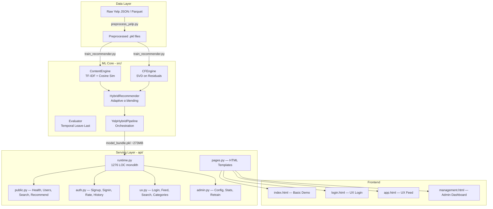

# 🔍 Yelp Hybrid RecSys — Phân Tích Dự Án & Đề Xuất Cải Tiến

## 1. Tổng Quan Kiến Trúc



---

## 2. Dự Án Đang Ở Đâu? — Status Assessment

### ✅ Đã Hoàn Thành Tốt

| Component | Status | Ghi chú |
|-----------|--------|---------|
| Data Pipeline (preprocess) | ✅ Complete | JSON + Parquet dual-source, chunked loading, US-only filter |
| Content-Based Engine | ✅ Complete | TF-IDF (80K features, bigrams), cosine similarity |
| Collaborative Filtering | ✅ Complete | Bias-aware SVD (TruncatedSVD on residuals), vectorized predictions |
| Hybrid Blending | ✅ Complete | Adaptive α (cold-start aware), recency-weighted content, popularity prior |
| Offline Evaluation | ✅ Complete | Temporal hold-out, Precision@K, Recall@K, NDCG@K, Coverage |
| Model Bundling | ✅ Complete | Pickle serialization, bundle_summary.json metadata |
| FastAPI Serving | ✅ Complete | 5 routers, health/checkpoint, hot-reload retrain |
| Local User System | ✅ Complete | Signup/signin, interaction logging, merged retraining |
| Admin Dashboard | ✅ Complete | Config, stats, retrain trigger, activity timeline |
| UX Demo Flow | ✅ Complete | Login → Feed (pagination) → Search → Categories |
| Explainability | ✅ Complete | Per-recommendation reason_tags, score breakdown |
| Geo/Map Support | ✅ Complete | lat/lng enrichment, business hours, open_now |
| Runbook/Scripts | ✅ Complete | Full pipeline, retrain shortcuts, checkpoint health |

### ⚠️ Vấn Đề Quan Trọng

| Issue | Severity | Chi tiết |
|-------|----------|----------|
| **Model Accuracy cực thấp** | 🔴 Critical | Precision@10 = 0.03%, Recall@10 = 0.33%, NDCG@10 = 0.26% |
| **runtime.py quá lớn** | 🟡 Medium | 1276 LOC, God-object pattern, khó maintain |
| **Không có tests** | 🟡 Medium | Zero unit/integration tests |
| **README trống** | 🟡 Medium | Không có documentation cho người mới |
| **Bundle size 273MB** | 🟡 Medium | Quá nặng cho deploy, pickle không portable |
| **Security yếu** | 🟡 Medium | SHA256 password (no bcrypt), no rate limiting, admin unprotected |
| **No CI/CD** | 🟡 Medium | Không có pipeline automation |

---

## 3. Phân Tích Sâu Theo Module

### 3.1 ML Core — `src/`

#### Content Engine ([content_base.py](file:///media/lovecrush/LoveCrush/Documents/project/pro_Yelp_Hybrid_RecSys_FinUniPro/src/content_base.py))
- **Cách hoạt động**: TF-IDF trên cột `soup` (name + categories + attributes) → cosine similarity
- **Điểm mạnh**: Simple, interpretable, handles cold-start
- **Điểm yếu**: 
  - Chỉ dùng bag-of-words, không capture semantic meaning
  - Không sử dụng review text (dù đã load được)
  - `max_features=80K` có thể quá lớn cho ~33K businesses

#### CF Engine ([collab_filter.py](file:///media/lovecrush/LoveCrush/Documents/project/pro_Yelp_Hybrid_RecSys_FinUniPro/src/collab_filter.py))
- **Cách hoạt động**: Bias-aware SVD — global mean + user bias + item bias + latent factors (64 components)
- **Điểm mạnh**: Vectorized predictions, proper bias decomposition
- **Điểm yếu**:
  - `n_components=64` có thể chưa optimal cho 346K users × 33K items
  - TruncatedSVD trên residuals là approximation — ALS hoặc BPR sẽ tốt hơn cho implicit feedback
  - Không có regularization tuning

#### Hybrid Engine ([hybrid_engine.py](file:///media/lovecrush/LoveCrush/Documents/project/pro_Yelp_Hybrid_RecSys_FinUniPro/src/hybrid_engine.py))
- **Cách hoạt động**: `score = (1-pw) × [α × content + (1-α) × cf_norm] + pw × prior`
  - `α` giảm exponentially theo số interactions (cold-start → content-heavy)
  - `prior_weight = 0.1` cho popularity signal
- **Điểm mạnh**: Elegant cold-start adaptation, candidate generation from multiple sources
- **Điểm yếu**:
  - Candidate limit (800 CF + 800 content + 400 prior) có thể bỏ lỡ items tốt
  - Không có negative sampling hay learning-to-rank

#### Evaluator ([evaluator.py](file:///media/lovecrush/LoveCrush/Documents/project/pro_Yelp_Hybrid_RecSys_FinUniPro/src/evaluator.py))
- **Cách hoạt động**: Temporal leave-last split → Precision/Recall/NDCG@K
- **Vấn đề nghiêm trọng**: Evaluation kết quả cực thấp (P@10 ≈ 0), có khả năng do:
  1. `relevance_threshold=4.0` quá khắt khe → rất ít test items thực sự "relevant"
  2. `n_test_items=1` → chỉ 1 item held-out → random baseline ~= 1/33K ≈ 0.003%
  3. Không giới hạn candidate set khi evaluate → tìm 1 kim trong 33K cây cỏ

> [!CAUTION]
> Metrics hiện tại **không phản ánh đúng chất lượng model**. Với 33K businesses và chỉ hold-out 1 item, P@10 dự kiến rất thấp ngay cả với model tốt. Cần cải thiện evaluation protocol trước khi kết luận model yếu.

### 3.2 API Layer — `api/`

#### Runtime ([runtime.py](file:///media/lovecrush/LoveCrush/Documents/project/pro_Yelp_Hybrid_RecSys_FinUniPro/api/runtime.py))

> [!WARNING]
> Đây là file lớn nhất (1276 LOC) và chứa **tất cả** business logic:
> - Global state management (dict-based)
> - Session management (in-memory)
> - User profile composition
> - Recommendation orchestration
> - Admin operations
> - Retrain job management
> - Business hours parsing
> - Geo enrichment
> 
> Nên tách ra ít nhất 4-5 service modules.

#### Routers
- Clean separation theo domain (public/auth/ux/admin/pages)
- Mỗi router chỉ delegate xuống runtime — đúng pattern
- **Thiếu**: input validation middleware, error handling middleware, CORS config

### 3.3 Frontend — `api/templates/`

| Template | Size | Mục đích |
|----------|------|----------|
| `index.html` | 33KB | Basic demo + explainability + map |
| `login.html` | 4KB | UX login page |
| `app.html` | 23KB | UX feed/recommendation app |
| `management.html` | 14KB | Admin management dashboard |

- Tất cả là monolithic HTML files (CSS + JS inline)
- Không có framework frontend
- Thích hợp cho demo, nhưng khó scale

---

## 4. 🔴 Vấn Đề #1: Model Performance

Đây là điểm cần tập trung cải thiện nhất:

```json
{
  "evaluated_users": 300,
  "precision@k": 0.00033,    // ≈ 0.03%
  "recall@k": 0.0033,        // ≈ 0.33%
  "ndcg@k": 0.0026,          // ≈ 0.26%
  "coverage": 0.0137          // ≈ 1.37%
}
```

### Nguyên nhân gốc rễ:

1. **Evaluation protocol quá khó**: Hold-out 1 item từ 33K candidates → random P@10 ≈ 0.03%. Model đang đạt khoảng ngang random baseline.

2. **SVD trên explicit ratings nhưng treat như ranking problem**: SVD tối ưu cho rating prediction (RMSE), nhưng evaluate bằng ranking metrics (P@K, NDCG). Hai objectives này khác nhau fundamentally.

3. **Coverage chỉ 1.37%**: Model chỉ recommend ~450 unique businesses / 33K → quá concentrated, thiếu diversity.

4. **Content engine hạn chế**: Bag-of-words TF-IDF không capture nuances (ví dụ: "cozy Italian bistro" vs "upscale Italian restaurant").

---

## 5. Đề Xuất Cải Tiến — Theo Thứ Tự Ưu Tiên

### 🟢 Tier 1: Quick Wins (1-3 ngày)

#### 5.1 Fix Evaluation Protocol
- Giới hạn candidate set khi evaluate (ví dụ: 500-1000 negative samples + 1 positive) → metrics sẽ phản ánh đúng hơn
- Thêm Hit Rate@K (đơn giản hơn precision khi n_test=1)
- Hạ `relevance_threshold` xuống 3.5 hoặc 3.0

#### 5.2 Tune Hyperparameters
- `n_components`: thử 128, 256 thay vì 64
- `prior_weight`: grid search [0.05, 0.1, 0.2, 0.3]
- `half_life`: thử [6, 12, 24]
- `content_recency_half_life`: thử [3, 6, 12]

#### 5.3 Viết README.md
- Project overview, setup, architecture diagram
- Demo screenshots
- API documentation links

#### 5.4 Thêm CORS cho API
```python
from fastapi.middleware.cors import CORSMiddleware
app.add_middleware(CORSMiddleware, allow_origins=["*"], ...)
```

---

### 🟡 Tier 2: Medium Effort (1-2 tuần)

#### 5.5 Tách `runtime.py` Thành Services
```
api/
├── services/
│   ├── state.py          # Global state management
│   ├── session.py        # Session + auth logic
│   ├── recommendation.py # Recommendation orchestration
│   ├── admin.py          # Admin operations
│   ├── geo.py            # Geo + business hours
│   └── profile.py        # User profile composition
├── routers/              # (giữ nguyên)
└── main.py
```

#### 5.6 Nâng Cấp CF Engine → ALS/BPR
- Thay TruncatedSVD bằng **implicit** library (ALS) hoặc **LightFM** (hybrid)
- Implicit feedback (viewed/clicked) thường tốt hơn explicit ratings cho ranking

#### 5.7 Nâng Cấp Content Engine → Sentence Embeddings
- Thay TF-IDF bằng **sentence-transformers** (`all-MiniLM-L6-v2`)
- Hoặc đơn giản hơn: thêm review text vào `soup` column

#### 5.8 Thêm Unit Tests
```
tests/
├── test_content_engine.py
├── test_cf_engine.py
├── test_hybrid_engine.py
├── test_evaluator.py
├── test_model_bundle.py
├── test_local_user_store.py
└── test_api_endpoints.py
```

#### 5.9 Giảm Bundle Size
- Tách TF-IDF matrix ra file riêng (sparse matrix → `scipy.sparse.save_npz`)
- Lưu SVD factors dạng numpy arrays thay vì toàn bộ engine
- Sử dụng compression (gzip pickle hoặc joblib)
- Target: 273MB → ~50-80MB

#### 5.10 Security Hardening
- Chuyển password hashing sang **bcrypt** hoặc **argon2**
- Thêm API key cho admin routes
- Rate limiting (slowapi)
- Session expiry (hiện tại sessions không bao giờ hết hạn)

---

### 🔵 Tier 3: Strategic (2-4 tuần)

#### 5.11 Online A/B Testing Framework
- Track click-through rate (CTR) per algorithm
- Implement simple multi-armed bandit cho algorithm selection

#### 5.12 Feature Engineering Nâng Cao
- **Temporal features**: day-of-week, seasonality effects
- **Social features**: friend overlap (Yelp có friend graph)
- **Location-aware**: distance-based scoring, neighborhood clustering
- **Business features**: price range, ambiance, parking (từ attributes)

#### 5.13 Deep Learning Approach
- Neural Collaborative Filtering (NCF)
- Hoặc two-tower model (user tower + item tower)
- Sử dụng PyTorch/TensorFlow, serve với ONNX

#### 5.14 Real-time Feature Store
- Chuyển từ pickle → feature store (Redis hoặc DuckDB)
- Hot-swap model without restart

#### 5.15 Containerization & CI/CD
- Dockerfile + docker-compose
- GitHub Actions pipeline
- Model versioning (MLflow hoặc DVC)

---

## 6. Project Status Rating

| Dimension | Score | Comment |
|-----------|-------|---------|
| **Code Quality** | 7/10 | Clean Python, good typing, nhưng runtime.py cần tách |
| **ML Architecture** | 7/10 | Solid hybrid design, nhưng algorithms hơi cơ bản |
| **Model Performance** | 3/10 | Metrics rất thấp (có phần do eval protocol) |
| **API Design** | 8/10 | RESTful, well-structured routers, good separation |
| **Frontend** | 6/10 | Functional demo, nhưng inline everything |
| **DevOps/Testing** | 2/10 | Không tests, không CI/CD, không containerization |
| **Documentation** | 5/10 | scripts.md tốt, nhưng README trống, thiếu API docs |
| **Security** | 3/10 | Basic auth only, no rate limiting, admin unprotected |

### Overall: **~55/100** — Prototype tốt, cần polish để production-ready

> [!IMPORTANT]
> **Recommendation**: Ưu tiên **fix evaluation protocol** (Tier 1.1) trước tiên — vì nếu metrics đang bị underestimate, model thực tế có thể tốt hơn nhiều so với con số 0.03%. Sau đó focus vào **hyperparameter tuning** và **tách runtime.py**.

---

## 7. Câu Hỏi Mở Cho Bạn

1. **Mục đích dự án**: Đây là đồ án học kỳ, thesis, hay side project? Sẽ ảnh hưởng đến mức độ cải tiến cần thiết.
2. **Timeline**: Bạn có bao nhiêu thời gian để cải tiến?  
3. **Ưu tiên**: Bạn muốn focus vào **model accuracy**, **production readiness**, hay **feature richness**?
4. **Deploy target**: Local demo, cloud deploy (Railway/Render), hay just notebook demo?
